# رسوم بيانية لمشروع منصة التعلم للأطفال
## Diagrams for Kids Learning Platform

---

## 1. Use Case Diagram (رسم حالات الاستخدام)

```mermaid
graph TB
    Parent[Parent<br/>الوالد]
    Child[Child<br/>الطفل]
    System[Kids Learning Platform<br/>منصة التعلم للأطفال]
    
    %% Parent Use Cases
    Parent -->|Login| UC1[Login]
    Parent -->|Signup| UC2[Create Account]
    Parent -->|Manage| UC3[Manage Children]
    Parent -->|Add| UC4[Add Child]
    Parent -->|Edit| UC5[Edit Child]
    Parent -->|Delete| UC6[Delete Child]
    Parent -->|Assign| UC7[Assign Tasks]
    Parent -->|View| UC8[View Reports]
    Parent -->|View| UC9[View Statistics]
    Parent -->|View| UC10[View Badges]
    Parent -->|Logout| UC11[Logout]
    
    %% Child Use Cases
    Child -->|View| UC12[View Current Task]
    Child -->|Start| UC13[Start Session]
    Child -->|Play| UC14[Play Game]
    Child -->|Complete| UC15[Complete Task]
    Child -->|Pause| UC16[Pause Session]
    Child -->|View| UC17[View Badges]
    Child -->|View| UC18[View Progress]
    
    %% System Use Cases
    System -->|Authenticate| UC1
    System -->|Register| UC2
    System -->|Store| UC3
    System -->|Create| UC4
    System -->|Update| UC5
    System -->|Remove| UC6
    System -->|Link| UC7
    System -->|Generate| UC8
    System -->|Calculate| UC9
    System -->|Award| UC10
    System -->|End| UC11
    System -->|Display| UC12
    System -->|Initialize| UC13
    System -->|Track| UC14
    System -->|Save| UC15
    System -->|Store| UC16
    System -->|Show| UC17
    System -->|Display| UC18
    
    style Parent fill:#667eea,stroke:#764ba2,color:#fff
    style Child fill:#f59e0b,stroke:#ff9800,color:#fff
    style System fill:#10b981,stroke:#059669,color:#fff
```

---

## 2. Data Flow Diagram (رسم تدفق البيانات)

### 2.1. Level 0 - Context Diagram

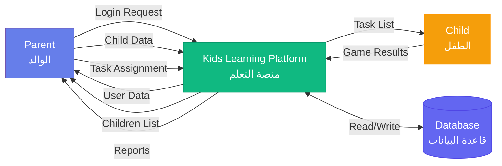

### 2.2. Level 1 - Process Flow

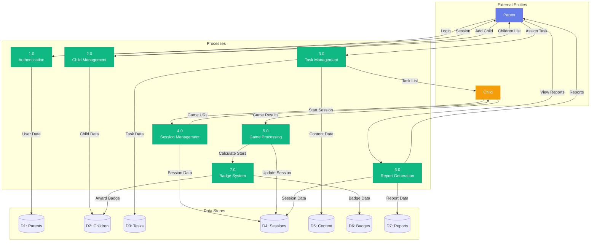

---

## 3. Activity Diagram (رسم الأنشطة)

### 3.1. Login Activity

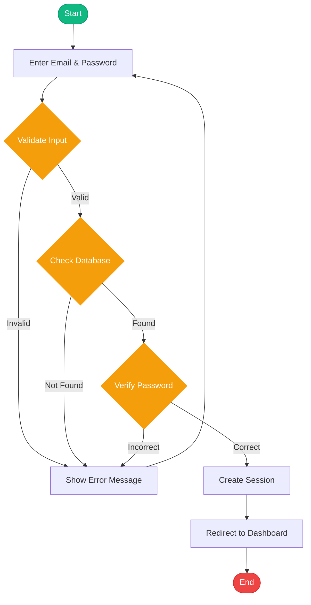

### 3.2. Start Learning Session Activity

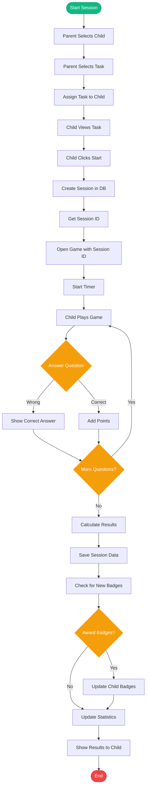

### 3.3. View Reports Activity

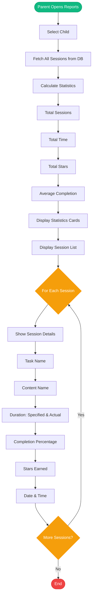

---

## 4. ER Diagram (رسم علاقات الكيانات)

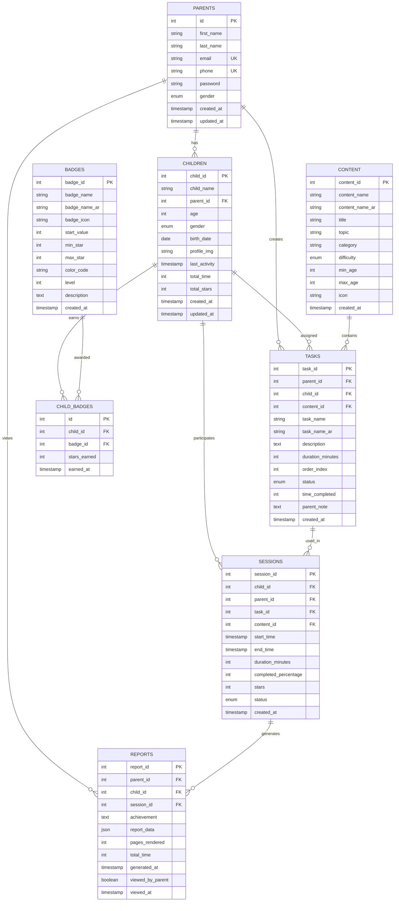

---

## 5. Sequence Diagram (رسم التسلسل)

### 5.1. Login Sequence

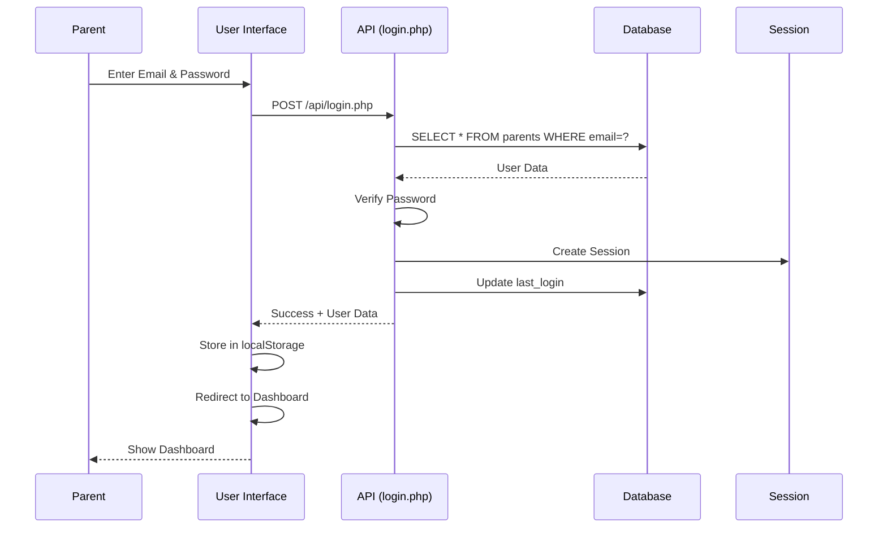

### 5.2. Start Learning Session Sequence

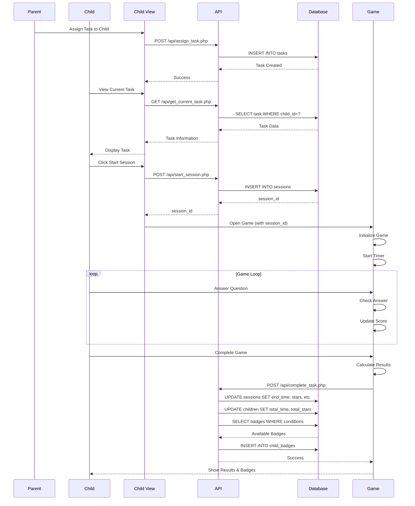

### 5.3. View Reports Sequence

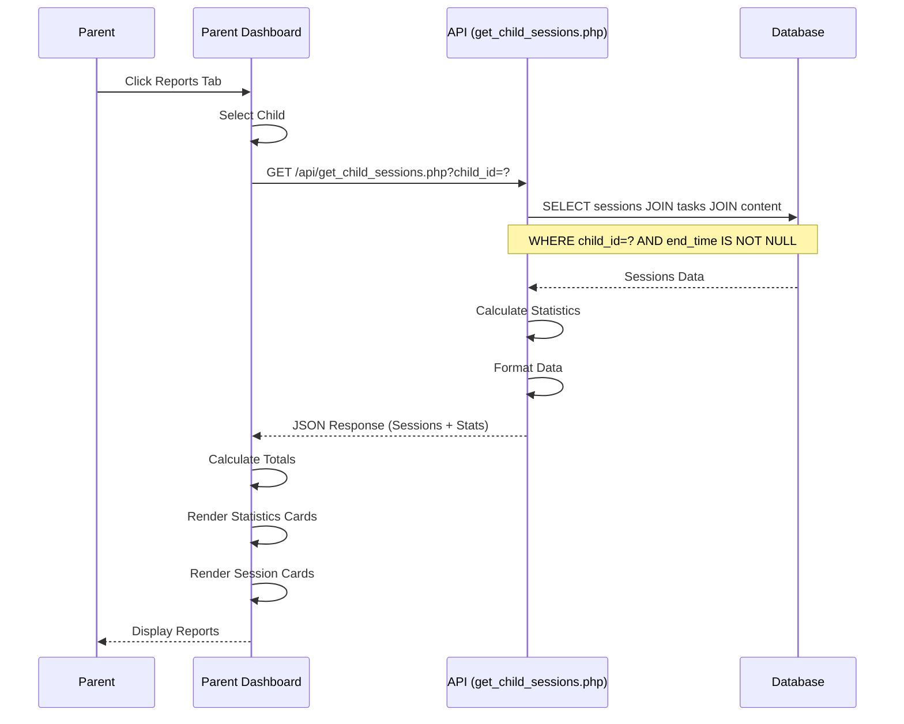

---

## 6. State Diagram (رسم الحالات)

### 6.1. Session State Diagram

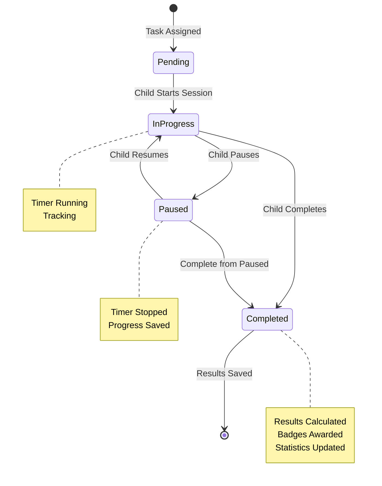

### 6.2. Task State Diagram

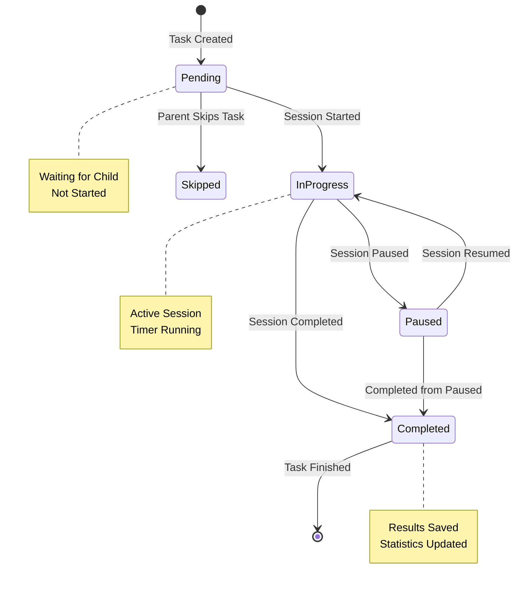

---

## 7. Component Diagram (رسم المكونات)

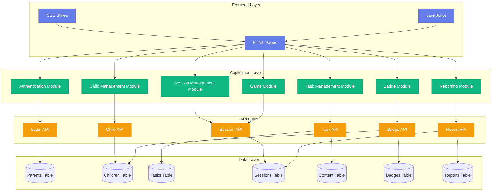

---

## ملاحظات (Notes)

### كيفية عرض الرسوم (How to View Diagrams):

1. **في GitHub**: الرسوم ستظهر تلقائياً في GitHub عند عرض الملف
2. **في VS Code**: استخدم إضافة "Markdown Preview Mermaid Support"
3. **أونلاين**: انسخ كود Mermaid إلى [Mermaid Live Editor](https://mermaid.live/)
4. **في Markdown Viewers**: معظم عارضي Markdown يدعمون Mermaid

### الملفات المطلوبة (Required Files):

- هذا الملف يحتوي على جميع الرسوم البيانية
- يمكنك نسخ أي رسم واستخدامه في ملفات أخرى
- جميع الرسوم تستخدم لغة Mermaid القياسية

### التحديثات (Updates):

- يمكن تحديث الرسوم حسب التغييرات في النظام
- جميع الرسوم متوافقة مع البنية الحالية للمشروع

---

**تاريخ الإنشاء**: 2025-01-15  
**الإصدار**: 1.0.0

