# مخططات التصميم المنطقي - Logical Design Diagrams
## منصة التعلم للأطفال - Kids Learning Platform

---

## 📊 1. مخطط قاعدة البيانات المنطقي (Database Logical Design - ERD)

### 1.1. مخطط علاقات الكيانات الكامل (Complete Entity Relationship Diagram)

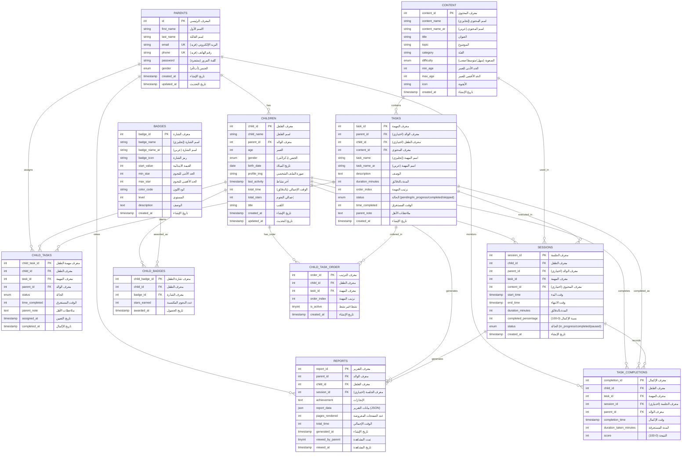

### 1.2. هيكل الجداول والعلاقات (Table Structure & Relationships)

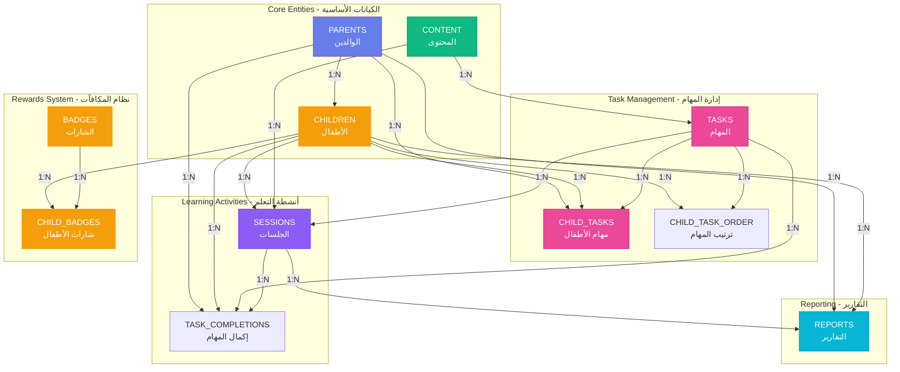

---

## 🏗️ 2. التصميم المعماري المنطقي (System Architecture Logical Design)

### 2.1. هيكل النظام الكامل (Complete System Architecture)

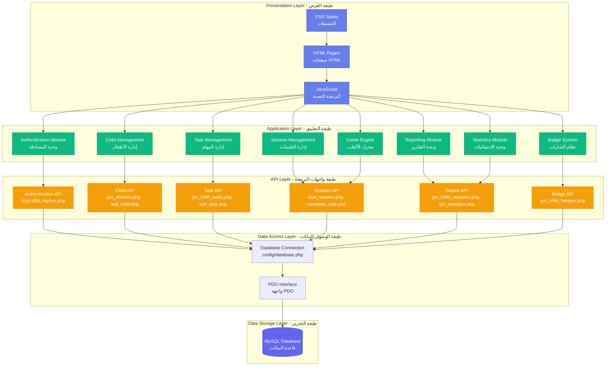

### 2.2. هيكل الوحدات والاعتماديات (Module Structure & Dependencies)

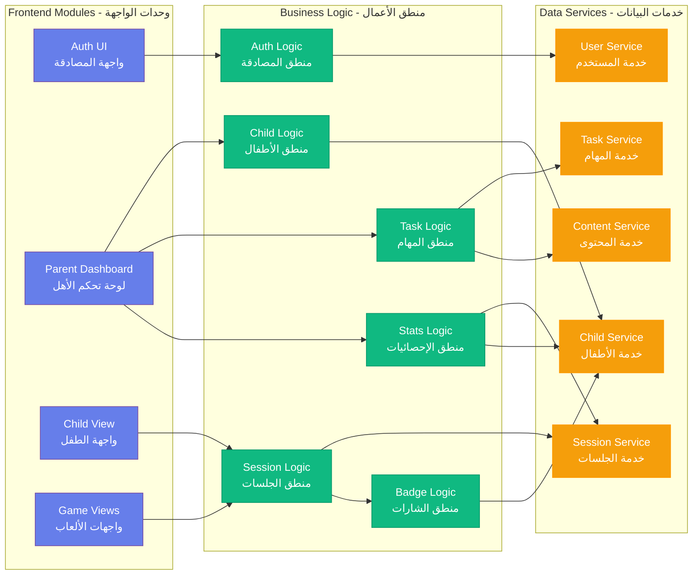

---

## 🔄 3. مخطط تدفق البيانات المنطقي (Data Flow Logical Design)

### 3.1. تدفق بيانات المصادقة (Authentication Data Flow)

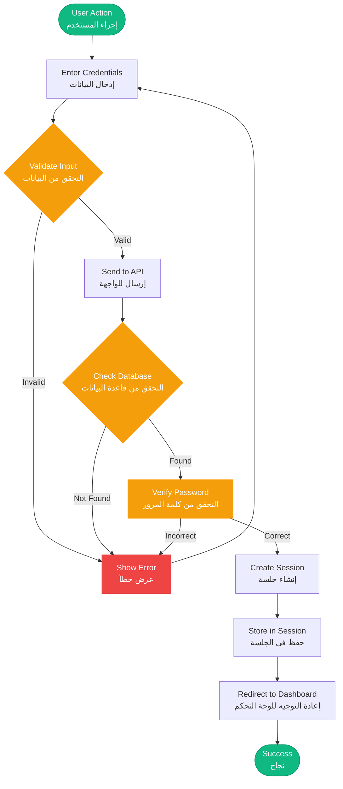

### 3.2. تدفق بيانات جلسة التعلم (Learning Session Data Flow)

```mermaid
flowchart TD
    START([Start Session<br/>بدء الجلسة]) --> ASSIGN[Parent Assigns Task<br/>الوالد يعين المهمة]
    ASSIGN --> SAVE_TASK[Save to child_tasks<br/>حفظ في مهام الأطفال]
    SAVE_TASK --> CHILD_VIEW[Child Views Task<br/>الطفل يعرض المهمة]
    CHILD_VIEW --> START_BTN[Child Clicks Start<br/>الطفل ينقر ابدأ]
    START_BTN --> CREATE_SESSION[Create Session Record<br/>إنشاء سجل الجلسة]
    CREATE_SESSION --> GET_CONTENT[Get Content Data<br/>جلب بيانات المحتوى]
    GET_CONTENT --> OPEN_GAME[Open Game Page<br/>فتح صفحة اللعبة]
    OPEN_GAME --> INIT_GAME[Initialize Game<br/>تهيئة اللعبة]
    INIT_GAME --> START_TIMER[Start Timer<br/>بدء المؤقت]
    START_TIMER --> GAME_LOOP[Game Loop<br/>حلقة اللعبة]
    
    GAME_LOOP --> ANSWER{Answer Question<br/>الإجابة على السؤال}
    ANSWER -->|Correct| ADD_POINTS[Add Points<br/>إضافة نقاط]
    ANSWER -->|Wrong| SHOW_CORRECT[Show Correct Answer<br/>عرض الإجابة الصحيحة]
    ADD_POINTS --> CHECK_MORE{More Questions?<br/>المزيد من الأسئلة؟}
    SHOW_CORRECT --> CHECK_MORE
    CHECK_MORE -->|Yes| GAME_LOOP
    CHECK_MORE -->|No| CALCULATE[Calculate Results<br/>حساب النتائج]
    
    CALCULATE --> CALC_STARS[Calculate Stars<br/>حساب النجوم]
    CALC_STARS --> UPDATE_SESSION[Update Session<br/>تحديث الجلسة]
    UPDATE_SESSION --> CHECK_BADGES[Check for Badges<br/>التحقق من الشارات]
    CHECK_BADGES --> AWARD_BADGES{Award Badges?<br/>منح الشارات؟}
    AWARD_BADGES -->|Yes| UPDATE_BADGES[Update Child Badges<br/>تحديث شارات الطفل]
    AWARD_BADGES -->|No| UPDATE_STATS[Update Statistics<br/>تحديث الإحصائيات]
    UPDATE_BADGES --> UPDATE_STATS
    UPDATE_STATS --> SHOW_RESULTS[Show Results<br/>عرض النتائج]
    SHOW_RESULTS --> END([End Session<br/>إنهاء الجلسة])
    
    style START fill:#10b981,stroke:#059669,color:#fff
    style END fill:#10b981,stroke:#059669,color:#fff
    style ANSWER fill:#f59e0b,stroke:#ff9800,color:#fff
    style CHECK_MORE fill:#f59e0b,stroke:#ff9800,color:#fff
    style AWARD_BADGES fill:#f59e0b,stroke:#ff9800,color:#fff
```

### 3.3. تدفق بيانات التقارير (Reports Data Flow)

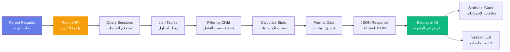

### 3.4. تنفيذ واجهة المستخدم (UI Implementation)

تم تصميم واجهة المستخدم (UI) لمنصة التعلم للأطفال بفلسفة مزدوجة: توفير بيئة احترافية تركز على البيانات للوالدين مع الحفاظ على تجربة نابضة بالحياة وجذابة ومبسطة للأطفال.

#### 3.4.1. لغة التصميم البصري (Visual Design Language)

لإنشاء هوية علامة تجارية متماسكة، تم تطبيق نظام تصميم موحد عالمياً عبر المنصة:

**لوحة الألوان (Color Palette)**: يستخدم الموضوع الأساسي تدرجاً لونياً حديثاً باللون البنفسجي-الأزرق (`linear-gradient(135deg, #667eea 0%, #764ba2 100%)`). تم اختيار هذه الألوان لتكون محفزة للأطفال لكن نظيفة بما يكفي لتقارير الوالدين.

**الطباعة (Typography)**: خط Cairo (مأخوذ من Google Fonts) هو الخط الأساسي. تم اختياره خصيصاً لوضوحه الهندسي في العربية، مما يضمن أن المتعلمين الصغار يمكنهم قراءة تعليمات المهام والتعليقات بسهولة.

**هندسة البطاقات (Card Architecture)**: لتنظيم المعلومات، تستخدم الواجهة تخطيطاً قائماً على "البطاقات". المكونات تتميز بخلفية بيضاء، زوايا دائرية (15px)، وظلال خفيفة لخلق إحساس بالعمق والتسلسل الهرمي.

#### 3.4.2. تنفيذ لوحة تحكم الوالدين (Parent Dashboard Implementation)

تركز لوحة تحكم الوالدين على الإدارة والتحليلات. وهي مقسمة إلى ثلاث مناطق وظيفية رئيسية:

**نظرة عامة على الأطفال (Children Overview)**: يعرض كل طفل كبطاقة ديناميكية تحتوي على صورة ملفه الشخصي، اسمه، وأزرار الوصول السريع للتقارير.

**تعيين المهام (Task Assignment)**: واجهة منظمة حيث يمكن للوالدين اختيار المحتوى التعليمي وتحديد حدود الوقت.

**نظام التقارير (Reporting System)**: يستخدم تخطيطاً شبكياً لعرض مقاييس الأداء، بما في ذلك النجوم المكتسبة ونسب الإكمال.

**مثال الكود (Code Snippet)**:

```css
/* تنسيقات بطاقات لوحة تحكم الوالدين */
.child-card {
    background: white;
    border-radius: 16px;
    padding: 25px;
    box-shadow: 0 4px 15px rgba(0,0,0,0.1);
    transition: all 0.3s ease;
    cursor: pointer;
}

.child-card:hover {
    transform: translateY(-5px); /* تفاعل بصري عند المرور */
    box-shadow: 0 20px 25px rgba(0,0,0,0.1);
}
```

#### 3.4.3. تنفيذ واجهة الطفل (Child Interface Implementation)

تم تبسيط عرض الطفل عن قصد لتقليل العبء المعرفي وإبقاء المستخدم مركزاً على نشاط التعلم:

**إبراز المهمة الحالية (Current Task Highlight)**: يتم تقديم المهمة النشطة في بطاقة كبيرة وذات تباين عالي لضمان أن تكون المحور الرئيسي.

**عناصر الألعاب (Gamified Elements)**: يتم عرض الشارات والنجوم بشكل بارز لتوفير مكافآت بصرية فورية للجهد.

**التنقل (Navigation)**: يستخدم أزراراً كبيرة وملائمة للمس مع أيقونات لتسهيل الاستخدام للأطفال الذين قد لا يزالون في طور تطوير مهاراتهم الحركية.

#### 3.4.4. هيكل واجهة الألعاب التعليمية (Educational Game UI Structure)

كل لعبة (العربية، الرياضيات، العلوم، إلخ) تتبع قالب UI موحد لضمان ألا يضطر الطفل لإعادة تعلم التنقل لمواضيع مختلفة:

**رأس اللعبة (Game Header)**: يعرض اسم اللعبة الحالية ومؤقتاً بصرياً في الوقت الفعلي يديره `task_timer.js`.

**منطقة اللعب التفاعلية (Interactive Play Area)**: منطقة مركزية حيث يتم عرض الأسئلة والرسوم المتحركة وعناصر السحب والإفلات.

**نافذة النتائج (Results Modal)**: طبقة علوية تظهر في نهاية الجلسة، تعرض النجوم المكتسبة (1-5) وزر "العودة إلى الرئيسية".

---

### 3.5. كيفية تطوير الوظائف الرئيسية (How Main Functionalities Have Been Developed)

تم تطوير المنصة باستخدام نهج معياري (Modular Approach)، حيث تم تطوير كل ميزة أساسية كمجموعة من API في الخادم (PHP/PDO) ووحدة تحكم في الواجهة الأمامية (JavaScript). يضمن هذا فصلًا واضحًا بين معالجة البيانات والتفاعل مع المستخدم.

#### 3.5.1. منطق نظام المصادقة (Authentication System Logic)

تم تصميم طبقة الأمان لحماية بيانات الوالدين وملفات الأطفال. تم تطبيق عملية أمان من خطوتين:

**تشفير البيانات (Data Encryption)**: أثناء عملية إنشاء الحساب، يستخدم النظام دالة `password_hash()` لتشفير كلمات المرور. يضمن هذا أن كلمات المرور تبقى آمنة حتى في حالة الوصول إلى قاعدة البيانات.

**أمان الجلسة (Session Security)**: بعد تسجيل الدخول، يبدأ النظام جلسة `$_SESSION` في PHP للتحقق من هوية المستخدم عبر الصفحات المختلفة.

**مثال الكود (Code Snippet)**:

```php
// api/login.php - منطق التحقق
$stmt = $pdo->prepare("SELECT * FROM parents WHERE email = ?");
$stmt->execute([$email]);
$user = $stmt->fetch();

if ($user && password_verify($password, $user['password'])) {
    session_start();
    $_SESSION['parent_id'] = $user['id'];
    $_SESSION['user_id'] = $user['id'];
    $_SESSION['user_name'] = $user['first_name'] . ' ' . $user['last_name'];
    echo json_encode(['success' => true]);
}
```

#### 3.5.2. منطق إدارة الأطفال المتعددين (Multi-Child Management Logic)

لتمكين الوالدين من إدارة عدة أطفال، تم تطوير نظام ربط ديناميكي:

**ربط الوالد-الطفل (Parent-Child Linking)**: كل سجل طفل في جدول `children` مرتبط بـ `parent_id`.

**التحميل الديناميكي (Dynamic Loading)**: تستخدم لوحة التحكم Fetch API لطلب فقط الأطفال الذين ينتمون إلى الجلسة النشطة، ثم يتم عرضهم كبطاقات تفاعلية.

#### 3.5.3. نظام الجلسة والمؤقت الدقيق (Precision Session and Timer System)

هذا هو الجزء الأكثر أهمية في المنصة، حيث يراقب وقت تعلم الطفل بدقة:

**الدقة على الخادم (Server-Side Accuracy)**: لمنع الأطفال من تجاوز المؤقت، يسجل النظام `start_time` على الخادم في اللحظة التي تبدأ فيها اللعبة.

**حساب المدة (Duration Calculation)**: عند انتهاء المهمة، لا يعتمد النظام على ساعة العميل. بدلاً من ذلك، يستخدم استعلام SQL لحساب الفرق بين وقت البداية والنهاية.

**مثال الكود (Code Snippet)**:

```sql
-- حساب الوقت الدقيق باستخدام SQL
UPDATE sessions 
SET end_time = NOW(), 
    duration_minutes = GREATEST(?, CEIL(TIMESTAMPDIFF(SECOND, start_time, NOW()) / 60.0)),
    completed_percentage = ?,
    stars = ?,
    status = 'completed' 
WHERE session_id = ?;
```

#### 3.5.4. منطق تكامل الألعاب التعليمية (Educational Games Integration Logic)

يتم دمج الألعاب التعليمية (العربية، الرياضيات، العلوم، إلخ) باستخدام "نمط الجسر" (Bridge Pattern):

**معاملات URL (URL Parameters)**: عندما يبدأ الطفل لعبة، يمرر النظام `session_id` عبر URL.

**واجهة موحدة (Unified API)**: بغض النظر عن نوع اللعبة، جميع الألعاب تستدعي نفس API `complete_task.php` في النهاية لحفظ النتائج، مما يضمن تقارير متسقة للوالد.

**مثال الكود (Code Snippet)**:

```javascript
// js/task_timer.js - مزامنة نتائج اللعبة مع قاعدة البيانات
async function finishLearningSession(stars, progress) {
    const sessionID = new URLSearchParams(window.location.search).get('session_id');
    
    await fetch('../api/complete_task.php', {
        method: 'POST',
        headers: {
            'Content-Type': 'application/json',
        },
        body: JSON.stringify({
            'session_id': sessionID,
            'stars': stars,
            'completed_percentage': progress
        })
    });
}
```

#### 3.5.5. منطق الشارات والمكافآت الآلي (Automated Badges and Reward Logic)

نظام التحفيز آلي بالكامل. بعد كل جلسة، يتم تشغيل سكريبت "Badge Trigger" لتقييم تقدم الطفل:

**فحص الإنجاز (Achievement Check)**: يستعلم النظام عن إجمالي النجوم المكتسبة من قبل الطفل.

**منح الشارة (Badge Awarding)**: إذا وصل الإجمالي إلى عتبة معينة (مثل 50 نجمة)، يتحقق النظام من وجود الشارة لدى الطفل. إذا لم تكن موجودة، يتم منحها وحفظها في جدول `child_badges`.

#### 3.5.6. مخطط التدفق التشغيلي للنظام (System Operational Flowchart)

يوضح المخطط التالي منطق التشغيل الشامل للمنصة، مع إظهار التفاعل بين لوحة تحكم الوالد، واجهة الطفل، وقاعدة البيانات.

```mermaid
flowchart TD
    START([بداية العملية<br/>Process Start]) --> LOGIN[تسجيل دخول الوالد<br/>Parent Login]
    LOGIN --> VALIDATE{التحقق من البيانات<br/>Validate Credentials}
    VALIDATE -->|فشل<br/>Failed| ERROR[عرض خطأ<br/>Show Error]
    ERROR --> LOGIN
    VALIDATE -->|نجح<br/>Success| DASHBOARD[لوحة تحكم الوالد<br/>Parent Dashboard]
    
    DASHBOARD --> GET_CHILDREN[جلب بيانات الأطفال<br/>api/get_children.php]
    GET_CHILDREN --> DISPLAY_CHILDREN[عرض ملفات الأطفال<br/>Display Child Profiles]
    
    DISPLAY_CHILDREN --> ASSIGN_TASK[تعيين مهمة<br/>Assign Task]
    ASSIGN_TASK --> CREATE_TASK[إنشاء مهمة في قاعدة البيانات<br/>Create Task Record]
    CREATE_TASK --> CHILD_INTERFACE[واجهة الطفل<br/>Child Interface]
    
    CHILD_INTERFACE --> CLICK_START[الطفل ينقر ابدأ<br/>Child Clicks Start]
    CLICK_START --> START_SESSION[api/start_session.php<br/>بدء الجلسة]
    START_SESSION --> RECORD_START[تسجيل start_time<br/>Record Start Time]
    RECORD_START --> GENERATE_ID[إنشاء session_id<br/>Generate Session ID]
    
    GENERATE_ID --> LOAD_GAME[تحميل اللعبة<br/>Load Educational Game]
    LOAD_GAME --> GAME_LOOP[حلقة اللعبة<br/>Game Loop]
    
    GAME_LOOP --> TRACK_TIME[تتبع الوقت محلياً<br/>task_timer.js<br/>Track Time Locally]
    GAME_LOOP --> CALCULATE_POINTS[حساب النقاط والنجوم<br/>Calculate Points & Stars]
    
    CALCULATE_POINTS --> COMPLETE_GAME[انتهاء اللعبة<br/>Game Completed]
    COMPLETE_GAME --> COMPLETE_TASK[api/complete_task.php<br/>إكمال المهمة]
    
    COMPLETE_TASK --> CALC_DURATION[حساب المدة الفعلية<br/>TIMESTAMPDIFF<br/>Calculate Actual Duration]
    CALC_DURATION --> SAVE_STARS[حفظ النجوم والنسبة<br/>Save Stars & Percentage]
    
    SAVE_STARS --> BADGE_CHECK[فحص الشارات<br/>Badge Check]
    BADGE_CHECK --> CHECK_TOTAL{التحقق من الإجمالي<br/>Check Total Stars}
    CHECK_TOTAL -->|وصل العتبة<br/>Threshold Met| AWARD_BADGE[منح الشارة<br/>Award Badge<br/>child_badges Table]
    CHECK_TOTAL -->|لم يصل<br/>Not Met| UPDATE_STATS[تحديث الإحصائيات<br/>Update Statistics]
    AWARD_BADGE --> UPDATE_STATS
    
    UPDATE_STATS --> DISPLAY_REWARD[عرض المكافأة<br/>Display Reward on Profile]
    DISPLAY_REWARD --> END([النهاية<br/>End])
    
    style START fill:#10b981,stroke:#059669,color:#fff
    style END fill:#10b981,stroke:#059669,color:#fff
    style DASHBOARD fill:#6366f1,stroke:#4f46e5,color:#fff
    style CHILD_INTERFACE fill:#ec4899,stroke:#db2777,color:#fff
    style LOAD_GAME fill:#f59e0b,stroke:#d97706,color:#fff
    style BADGE_CHECK fill:#8b5cf6,stroke:#7c3aed,color:#fff
    style AWARD_BADGE fill:#06b6d4,stroke:#0891b2,color:#fff
    style VALIDATE fill:#f59e0b,stroke:#ff9800,color:#fff
    style CHECK_TOTAL fill:#f59e0b,stroke:#ff9800,color:#fff
    style ERROR fill:#ef4444,stroke:#dc2626,color:#fff
```

**وصف التدفق المنطقي (Description of the Logical Flow)**:

1. **مرحلة المصادقة (Authentication Phase)**: تبدأ العملية بتسجيل دخول الوالد. يتحقق النظام من البيانات مقابل قاعدة البيانات. عند النجاح، يتم تهيئة لوحة تحكم الوالد، ويتم جلب ملفات الأطفال باستخدام `api/get_children.php`.

2. **تعيين المهمة (Task Assignment)**: يختار الوالد طفلاً ويعين مهمة تعليمية محددة (مثل لعبة الرياضيات). هذا ينشئ مهمة معلقة مرتبطة بمعرف الطفل.

3. **بدء الجلسة (Session Initiation)**: عندما يدخل الطفل إلى واجهته وينقر "ابدأ"، يتم تشغيل `api/start_session.php`. يسجل الخادم `start_time` وينشئ `session_id` فريداً.

4. **نشاط التعلم (Learning Activity)**: يتفاعل الطفل مع اللعبة التعليمية. خلال هذه المرحلة، يتتبع `task_timer.js` المدة محلياً بينما يحسب منطق اللعبة النقاط والنجوم.

5. **مزامنة البيانات (Data Synchronization)**: عند الإكمال، يتم استدعاء `api/complete_task.php`. يحسب الخادم المدة الفعلية باستخدام `TIMESTAMPDIFF` ويحفظ النجوم ونسبة الإكمال.

6. **منطق المكافآت (Badge Trigger)**: بعد حفظ الجلسة مباشرة، يتم تشغيل فحص الشارات. إذا وصل التقدم التراكمي إلى المعايير المحددة (مثل 50 نجمة إجمالية)، يتم إضافة سجل جديد إلى جدول `child_badges`، ويتم عرض المكافأة على ملف الطفل.

---

## 🔌 4. هيكل واجهات البرمجة (API Structure Logical Design)

### 4.1. هيكل API الكامل (Complete API Structure)

```mermaid
graph TB
    subgraph "Authentication APIs - واجهات المصادقة"
        LOGIN[login.php<br/>تسجيل الدخول]
        SIGNUP[signup.php<br/>إنشاء حساب]
        LOGOUT[logout.php<br/>تسجيل الخروج]
        GET_USER[get_current_user.php<br/>جلب المستخدم الحالي]
    end
    
    subgraph "Child Management APIs - واجهات إدارة الأطفال"
        GET_CHILDREN[get_children.php<br/>جلب قائمة الأطفال]
        ADD_CHILD[add_child.php<br/>إضافة طفل]
        UPDATE_CHILD[update_child.php<br/>تحديث طفل]
        DELETE_CHILD[delete_child.php<br/>حذف طفل]
        GET_CHILD_DETAILS[get_child_details.php<br/>تفاصيل الطفل]
        GET_CHILD_TITLE[get_child_title.php<br/>لقب الطفل]
    end
    
    subgraph "Task Management APIs - واجهات إدارة المهام"
        GET_TASKS[get_child_tasks.php<br/>جلب مهام الطفل]
        GET_CURRENT_TASK[get_current_task.php<br/>المهمة الحالية]
        ADD_TASK[tasks/add_task.php<br/>إضافة مهمة]
        DELETE_TASK[tasks/delete_task.php<br/>حذف مهمة]
        REORDER_TASK[tasks/reorder_task.php<br/>إعادة ترتيب المهام]
        GET_CONTENT[tasks/get_all_content.php<br/>جلب جميع المحتويات]
        GET_CONTENT_AGE[tasks/get_content_by_age.php<br/>المحتوى حسب العمر]
    end
    
    subgraph "Session Management APIs - واجهات إدارة الجلسات"
        START_SESSION[start_session.php<br/>بدء جلسة]
        COMPLETE_TASK[complete_task.php<br/>إكمال مهمة]
        GET_SESSIONS[get_child_sessions.php<br/>جلب جلسات الطفل]
    end
    
    subgraph "Content & Game APIs - واجهات المحتوى والألعاب"
        GET_CHILD_CONTENT[get_child_content.php<br/>محتوى الطفل]
        GET_ACHIEVEMENTS[get_child_achievements.php<br/>إنجازات الطفل]
    end
    
    subgraph "Rewards & Statistics APIs - واجهات المكافآت والإحصائيات"
        GET_BADGES[get_child_badges.php<br/>شارات الطفل]
        GET_STATISTICS[get_statistics.php<br/>الإحصائيات]
    end
    
    subgraph "Parent Profile APIs - واجهات ملف الوالد"
        UPDATE_PARENT_NAME[update_parent_name.php<br/>تحديث اسم الوالد]
        UPDATE_PARENT_EMAIL[update_parent_email.php<br/>تحديث بريد الوالد]
    end
    
    LOGIN --> DB[(Database)]
    SIGNUP --> DB
    GET_USER --> DB
    GET_CHILDREN --> DB
    ADD_CHILD --> DB
    UPDATE_CHILD --> DB
    DELETE_CHILD --> DB
    GET_TASKS --> DB
    ADD_TASK --> DB
    START_SESSION --> DB
    COMPLETE_TASK --> DB
    GET_BADGES --> DB
    GET_STATISTICS --> DB
    
    style LOGIN fill:#10b981,stroke:#059669,color:#fff
    style SIGNUP fill:#10b981,stroke:#059669,color:#fff
    style GET_CHILDREN fill:#f59e0b,stroke:#ff9800,color:#fff
    style ADD_CHILD fill:#f59e0b,stroke:#ff9800,color:#fff
    style GET_TASKS fill:#8b5cf6,stroke:#7c3aed,color:#fff
    style START_SESSION fill:#ec4899,stroke:#db2777,color:#fff
    style COMPLETE_TASK fill:#ec4899,stroke:#db2777,color:#fff
    style GET_BADGES fill:#f59e0b,stroke:#ff9800,color:#fff
    style DB fill:#6366f1,stroke:#4f46e5,color:#fff
```

### 4.2. تدفق طلبات API (API Request Flow)

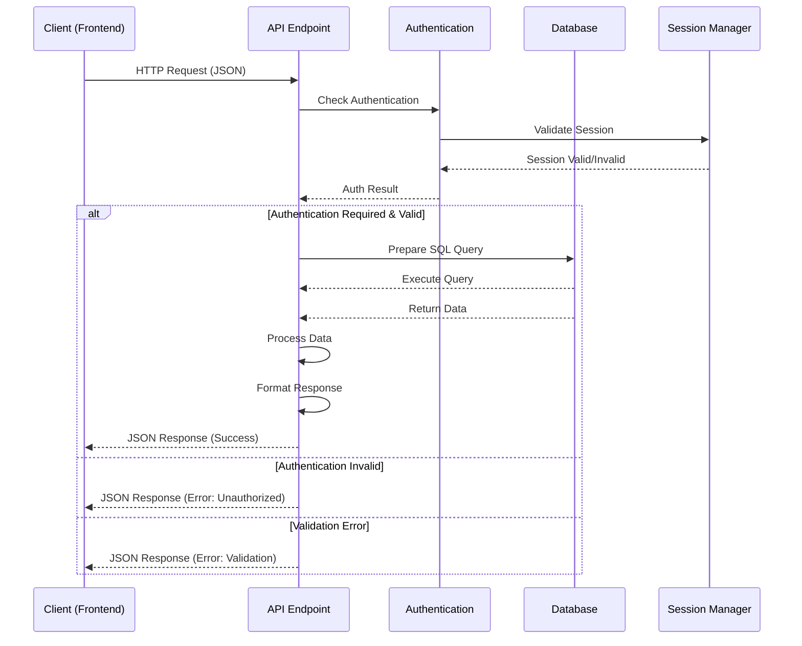

---

## 🎯 5. منطق الأعمال الرئيسي (Core Business Logic)

### 5.1. منطق نظام الشارات والنجوم (Badge & Star Logic)

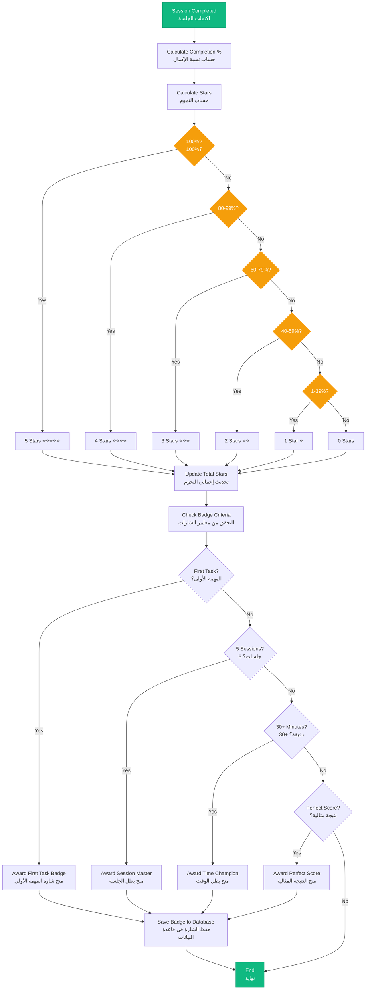

### 5.2. منطق إدارة المهام (Task Management Logic)

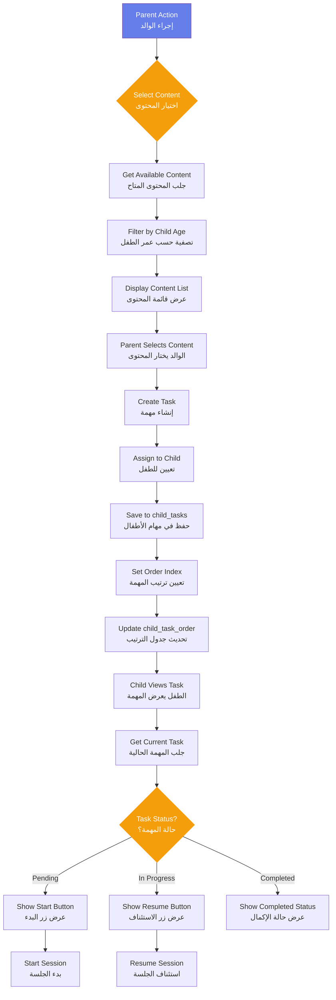

---

## 📐 6. هيكل البيانات المنطقي (Data Structure Logical Design)

### 6.1. هيكل البيانات الرئيسي (Main Data Structures)

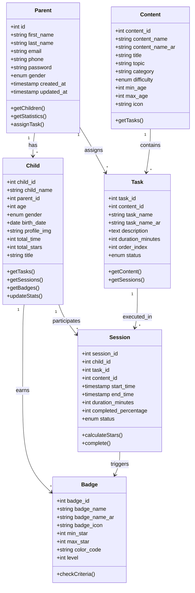

---

## 🔐 7. التصميم الأمني المنطقي (Security Logical Design)

### 7.1. تدفق الأمان والمصادقة (Security & Authentication Flow)

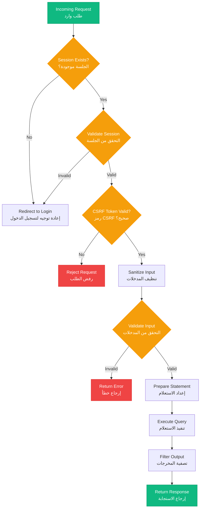

---

## 🎨 8. تصميم واجهة المستخدم (User Interface Design)

### 8.1. هيكل الصفحات والتنقل (Pages Structure & Navigation)

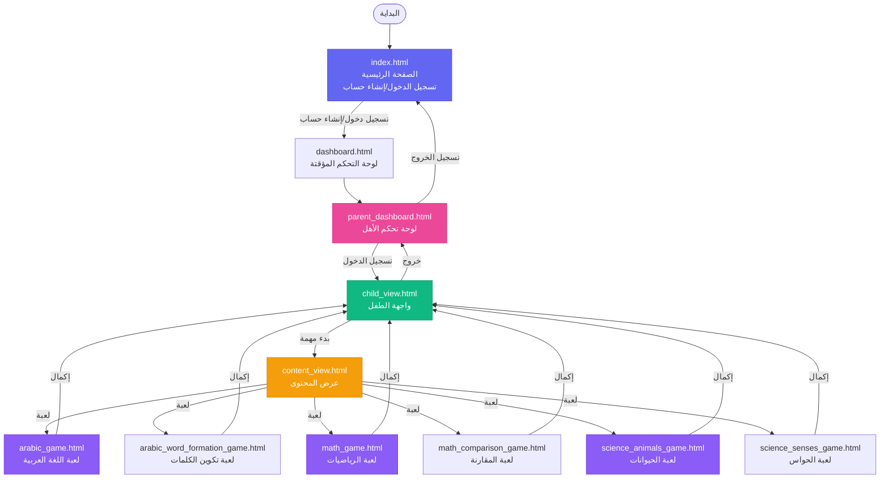

### 8.2. هيكل صفحة تسجيل الدخول (Login Page Structure)

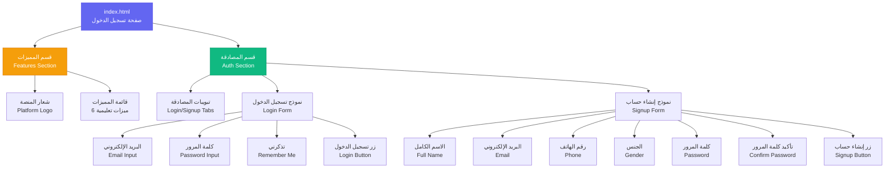

### 8.3. هيكل لوحة تحكم الأهل (Parent Dashboard Structure)

```mermaid
graph TB
    PARENT_DASH[parent_dashboard.html<br/>لوحة تحكم الأهل]
    
    PARENT_DASH --> HEADER[رأس الصفحة<br/>Header]
    PARENT_DASH --> NAV[التنقل<br/>Navigation Tabs]
    PARENT_DASH --> MAIN[المحتوى الرئيسي<br/>Main Content]
    PARENT_DASH --> MODALS[النوافذ المنبثقة<br/>Modals]
    
    HEADER --> HEADER_TITLE[عنوان المنصة<br/>Platform Title]
    HEADER --> HEADER_WELCOME[رسالة الترحيب<br/>Welcome Message]
    HEADER --> HEADER_SETTINGS[زر الإعدادات<br/>Settings Button]
    HEADER --> HEADER_LOGOUT[زر تسجيل الخروج<br/>Logout Button]
    
    NAV --> TAB_REPORTS[تبويب التقارير<br/>Reports Tab]
    NAV --> TAB_CHILDREN[تبويب الأطفال<br/>Children Tab]
    NAV --> TAB_PERSONAL[تبويب المعلومات الشخصية<br/>Personal Info Tab]
    
    MAIN --> SECTION_PERSONAL[قسم المعلومات الشخصية<br/>Personal Information Section]
    MAIN --> SECTION_CHILDREN[قسم إدارة الأطفال<br/>Children Management Section]
    MAIN --> SECTION_REPORTS[قسم التقارير<br/>Reports Section]
    
    SECTION_PERSONAL --> PERSONAL_INFO[معلومات الوالد<br/>Parent Info Grid]
    PERSONAL_INFO --> INFO_NAME[الاسم<br/>Name]
    PERSONAL_INFO --> INFO_GENDER[الجنس<br/>Gender]
    PERSONAL_INFO --> INFO_EMAIL[البريد<br/>Email]
    PERSONAL_INFO --> INFO_COUNT[عدد الأطفال<br/>Children Count]
    
    SECTION_CHILDREN --> CHILDREN_HEADER[رأس القسم<br/>Section Header]
    CHILDREN_HEADER --> BTN_ADD_CHILD[زر إضافة طفل<br/>Add Child Button]
    SECTION_CHILDREN --> CHILDREN_GRID[شبكة الأطفال<br/>Children Grid]
    CHILDREN_GRID --> CHILD_CARD[بطاقة الطفل<br/>Child Card]
    CHILD_CARD --> CHILD_AVATAR[صورة الطفل<br/>Avatar]
    CHILD_CARD --> CHILD_INFO[معلومات الطفل<br/>Child Info]
    CHILD_CARD --> CHILD_STATS[إحصائيات الطفل<br/>Child Stats]
    CHILD_CARD --> CHILD_BADGES[شارات الطفل<br/>Child Badges]
    CHILD_CARD --> CHILD_BTNS[أزرار الإدارة<br/>Action Buttons]
    CHILD_BTNS --> BTN_START[زر البدء<br/>Start Button]
    CHILD_BTNS --> BTN_MANAGE[زر الإدارة<br/>Manage Button]
    
    SECTION_REPORTS --> REPORTS_CONTAINER[حاوية التقارير<br/>Reports Container]
    
    MODALS --> MODAL_ADD_CHILD[نافذة إضافة طفل<br/>Add Child Modal]
    MODALS --> MODAL_EDIT_CHILD[نافذة تعديل طفل<br/>Edit Child Modal]
    MODALS --> MODAL_TASKS[نافذة إدارة المهام<br/>Tasks Management Modal]
    MODALS --> MODAL_SETTINGS[نافذة الإعدادات<br/>Settings Modal]
    
    MODAL_ADD_CHILD --> FORM_ADD_CHILD[نموذج إضافة طفل<br/>Add Child Form]
    FORM_ADD_CHILD --> INPUT_CHILD_NAME[اسم الطفل<br/>Child Name]
    FORM_ADD_CHILD --> INPUT_CHILD_GENDER[جنس الطفل<br/>Gender]
    FORM_ADD_CHILD --> INPUT_BIRTH_DATE[تاريخ الميلاد<br/>Birth Date]
    
    style PARENT_DASH fill:#ec4899,stroke:#db2777,color:#fff
    style HEADER fill:#6366f1,stroke:#4f46e5,color:#fff
    style SECTION_CHILDREN fill:#10b981,stroke:#059669,color:#fff
    style SECTION_REPORTS fill:#f59e0b,stroke:#d97706,color:#fff
    style MODALS fill:#8b5cf6,stroke:#7c3aed,color:#fff
```

### 8.4. هيكل واجهة الطفل (Child View Structure)

```mermaid
graph TB
    CHILD_VIEW[child_view.html<br/>واجهة الطفل]
    
    CHILD_VIEW --> CHILD_HEADER[رأس الطفل<br/>Child Header]
    CHILD_VIEW --> CURRENT_TASK[المهمة الحالية<br/>Current Task Section]
    CHILD_VIEW --> ALL_TASKS[جميع المهام<br/>All Tasks Section]
    CHILD_VIEW --> BADGES_SECTION[قسم الشارات<br/>Badges Section]
    
    CHILD_HEADER --> CHILD_AVATAR_LARGE[صورة الطفل الكبيرة<br/>Large Avatar]
    CHILD_HEADER --> CHILD_NAME_DISPLAY[اسم الطفل<br/>Child Name]
    CHILD_HEADER --> CHILD_TITLE[لقب الطفل<br/>Child Title]
    CHILD_HEADER --> CHILD_STARS[النجوم الإجمالية<br/>Total Stars]
    CHILD_HEADER --> CHILD_STATS_DISPLAY[إحصائيات الطفل<br/>Child Stats]
    CHILD_HEADER --> BTN_EXIT[زر الخروج<br/>Exit Button]
    
    CURRENT_TASK --> TASK_CARD[بطاقة المهمة<br/>Task Card]
    TASK_CARD --> TASK_HEADER[رأس المهمة<br/>Task Header]
    TASK_HEADER --> TASK_ICON[أيقونة المهمة<br/>Task Icon]
    TASK_HEADER --> TASK_NAME[اسم المهمة<br/>Task Name]
    TASK_HEADER --> TASK_SUBJECT[موضوع المهمة<br/>Task Subject]
    
    TASK_CARD --> TASK_TIMER[مؤقت المهمة<br/>Task Timer]
    TASK_TIMER --> TIMER_CIRCLE[دائرة المؤقت<br/>Timer Circle]
    TASK_TIMER --> TIMER_TEXT[نص المؤقت<br/>Timer Text]
    
    TASK_CARD --> TASK_DESC[وصف المهمة<br/>Task Description]
    TASK_CARD --> PARENT_NOTE[ملاحظات الأهل<br/>Parent Note]
    TASK_CARD --> TASK_ACTIONS[أزرار المهمة<br/>Task Actions]
    TASK_ACTIONS --> BTN_START_TASK[زر البدء<br/>Start Task Button]
    TASK_ACTIONS --> BTN_PAUSE_TASK[زر الإيقاف<br/>Pause Button]
    TASK_ACTIONS --> BTN_COMPLETE_TASK[زر الإكمال<br/>Complete Button]
    
    ALL_TASKS --> TASKS_LIST[قائمة المهام<br/>Tasks List]
    TASKS_LIST --> TASK_ITEM[عنصر مهمة<br/>Task Item Card]
    TASK_ITEM --> TASK_NUMBER[رقم المهمة<br/>Task Number]
    TASK_ITEM --> TASK_ITEM_INFO[معلومات المهمة<br/>Task Info]
    TASK_ITEM --> TASK_STATUS[حالة المهمة<br/>Task Status]
    
    BADGES_SECTION --> BADGES_GRID[شبكة الشارات<br/>Badges Grid]
    BADGES_GRID --> BADGE_ITEM[بطاقة الشارة<br/>Badge Card]
    BADGE_ITEM --> BADGE_ICON[أيقونة الشارة<br/>Badge Icon]
    BADGE_ITEM --> BADGE_TITLE[عنوان الشارة<br/>Badge Title]
    BADGE_ITEM --> BADGE_STARS[نجوم الشارة<br/>Badge Stars]
    
    style CHILD_VIEW fill:#10b981,stroke:#059669,color:#fff
    style CHILD_HEADER fill:#6366f1,stroke:#4f46e5,color:#fff
    style CURRENT_TASK fill:#f59e0b,stroke:#d97706,color:#fff
    style ALL_TASKS fill:#8b5cf6,stroke:#7c3aed,color:#fff
    style BADGES_SECTION fill:#ec4899,stroke:#db2777,color:#fff
```

### 8.5. هيكل صفحات الألعاب (Game Pages Structure)

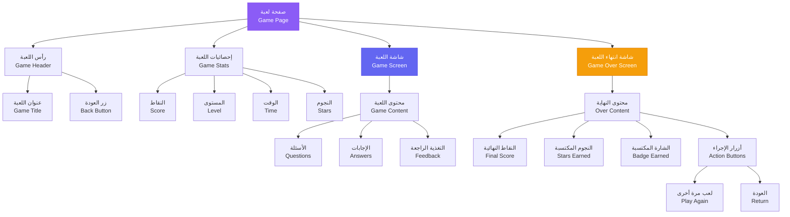

### 8.6. هيكل المكونات الرئيسية (Main Components Structure)

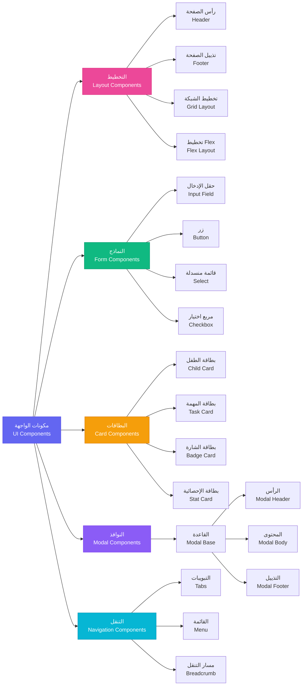

### 8.7. الوصف النصي للواجهات (Textual UI Descriptions)

يوضح هذا القسم وصفاً نصياً تفصيلياً لتصميم وتخطيط جميع صفحات المنصة، بما في ذلك المكونات وترتيبها ووظائفها.

#### 8.7.1. صفحة تسجيل الدخول (Login Page Layout)

**الموقع**: `html/index.html`

**التخطيط العام**: الصفحة مقسمة إلى قسمين رئيسيين بجانب بعضهما البعض:

**القسم الأيسر - قسم المميزات (Features Section)**:
- يحتوي على شعار المنصة في الأعلى بعنوان "🎓 منصة التعلم للأطفال"
- أسفل الشعار توجد قائمة بستة مميزات رئيسية، كل مميزة معروضة في بطاقة منفصلة:
  1. **ألعاب تعليمية** 🎮: نص يصف مجموعة متنوعة من الألعاب التفاعلية
  2. **محتوى متنوع** 📚: نص عن آلاف الدروس والأنشطة
  3. **نظام المكافآت** 🏆: نص عن النقاط والجوائز
  4. **متابعة الوالدين** 👨‍👩‍👧‍👦: نص عن التقارير المفصلة
  5. **تقارير التقدم** 📊: نص عن الإحصائيات الشاملة
  6. **أمان عالي** 🔒: نص عن البيئة الآمنة

**القسم الأيمن - قسم المصادقة (Auth Section)**:
- في الأعلى توجد تبويبات للتبديل بين "تسجيل الدخول" و "إنشاء حساب جديد"
- **نموذج تسجيل الدخول** يحتوي على:
  - عنوان ترحيبي: "مرحباً بعودتك!"
  - حقل إدخال البريد الإلكتروني مع تسمية واضحة
  - حقل إدخال كلمة المرور مع زر لإظهار/إخفاء كلمة المرور
  - مربع اختيار "تذكرني"
  - زر كبير لتسجيل الدخول بلون مميز
  - رسائل الخطأ تظهر أسفل الحقول عند الحاجة
- **نموذج إنشاء حساب** يحتوي على:
  - الحقول: الاسم الكامل، البريد الإلكتروني، رقم الهاتف، الجنس (أب/أم)، كلمة المرور، تأكيد كلمة المرور
  - زر لإنشاء الحساب
  - رسائل التحقق والخطأ

**الألوان والتصميم**: خلفية متدرجة (gradient) باللون البنفسجي-الأزرق، البطاقات بيضاء مع ظل خفيف، تصميم نظيف وحديث

**الرسم التوضيحي النصي للتصميم (Textual UI Sketch)**:

**القسم الأيسر - عرض المميزات (Features Section - 50% من العرض)**:
- **الشعار**: في أعلى القسم، عنوان كبير "🎓 منصة التعلم للأطفال" بخط واضح وجذاب
- **قائمة المميزات**: أسفل الشعار، ست بطاقات مميزات مرتبة عمودياً بمسافات متساوية
  - **بطاقة الميزة الواحدة** تحتوي على:
    - أيقونة كبيرة في الأعلى: 🎮 أو 📚 أو 🏆 أو 👨‍👩‍👧‍👦 أو 📊 أو 🔒
    - عنوان الميزة بخط عريض وواضح
    - نص وصفي تحته بخط أصغر يشرح الميزة
  - **تصميم البطاقة**: خلفية بيضاء أو شفافة مع حدود خفيفة وظل خفيف لإبرازها

**القسم الأيمن - منطقة المصادقة (Auth Section - 50% من العرض)**:
- **النافذة الرئيسية**: نافذة بيضاء بارزة في المنتصف مع ظل لإبرازها عن الخلفية
- **شريط التبويبات**: في أعلى النافذة، تبويبان جنباً إلى جنب
  - التبويب النشط: "تسجيل الدخول" بخلفية ملونة وحدود بارزة
  - التبويب غير النشط: "إنشاء حساب جديد" بخلفية فاتحة
- **نموذج تسجيل الدخول** (يظهر عند النقر على تبويب تسجيل الدخول):
  - **العنوان الترحيبي**: "مرحباً بعودتك!" بخط كبير في الأعلى
  - **حقل البريد الإلكتروني**:
    - تسمية الحقل: "البريد الإلكتروني"
    - حقل إدخال مستطيل مع حدود خفيفة
    - مساحة كافية لإدخال النص
  - **حقل كلمة المرور**:
    - تسمية الحقل: "كلمة المرور"
    - حقل إدخال مع زر عين 👁️ على اليمين لإظهار/إخفاء كلمة المرور
    - أسفل الحقل: مربع اختيار صغير "تذكرني" مع تسمية
  - **زر الإرسال**: زر كبير أسفل جميع الحقول بنص "تسجيل الدخول" بخلفية ملونة جذابة
- **نموذج إنشاء حساب** (يظهر عند النقر على تبويب إنشاء حساب، مخفى افتراضياً):
  - نفس تخطيط نموذج تسجيل الدخول
  - حقول إضافية: الاسم الكامل، رقم الهاتف، الجنس (قائمة منسدلة)، تأكيد كلمة المرور

**التفاصيل البصرية والتصميم**:
- **الخلفية العامة**: تدرج لوني (gradient) من البنفسجي إلى الأزرق يعطي مظهراً عصرياً
- **البطاقات والمكونات**: خلفية بيضاء مع ظل خفيف لإعطاء عمق بصري
- **الأزرار**: ألوان زاهية (أخضر/بنفسجي) مع تأثير hover (تغيير اللون عند المرور بالفأرة)
- **حقول الإدخال**: حدود خفيفة تتحول إلى لون مميز وأكثر سماكة عند التركيز (focus state)
- **التصميم المتجاوب**: على الشاشات الصغيرة (موبايل/تابلت)، الأقسام تصبح عمودية بدلاً من أفقية لسهولة الاستخدام

**الرسم التوضيحي البصري (Visual Sketch)**:

```
╔═══════════════════════════════════════════════════════════════════════════╗
║                                                                           ║
║                         منصة التعلم للأطفال 🎓                            ║
║                                                                           ║
╠═══════════════════════════════════════════════════════════════════════════╣
║                                                                           ║
║  ┌─────────────────────────────────────┐  ┌──────────────────────────────┐ ║
║  │                                     │  │                              │ ║
║  │  🎓 منصة التعلم للأطفال            │  │                              │ ║
║  │                                     │  │                              │ ║
║  │  ┌───────────────────────────────┐  │  │  ┌────────────────────────┐ │ ║
║  │  │  🎮                          │  │  │  │ تسجيل الدخول │ حساب   │ │ ║
║  │  │  ألعاب تعليمية               │  │  │  └────────────────────────┘ │ ║
║  │  │  مجموعة متنوعة من الألعاب    │  │  │                              │ ║
║  │  │  التفاعلية                   │  │  │  ┌────────────────────────┐ │ ║
║  │  └───────────────────────────────┘  │  │  │  مرحباً بعودتك!        │ │ ║
║  │                                     │  │  └────────────────────────┘ │ ║
║  │  ┌───────────────────────────────┐  │  │                              │ ║
║  │  │  📚                          │  │  │  البريد الإلكتروني:        │ ║
║  │  │  محتوى متنوع                │  │  │  ┌────────────────────────┐ │ ║
║  │  │  آلاف الدروس والأنشطة       │  │  │  │                        │ │ ║
║  │  └───────────────────────────────┘  │  │  └────────────────────────┘ │ ║
║  │                                     │  │                              │ ║
║  │  ┌───────────────────────────────┐  │  │  كلمة المرور:               │ ║
║  │  │  🏆                          │  │  │  ┌──────────────────────┐  │ ║
║  │  │  نظام المكافآت              │  │  │  │                  👁️ │  │ ║
║  │  │  نقاط وجوائز عند الإكمال    │  │  │  └──────────────────────┘  │ ║
║  │  └───────────────────────────────┘  │  │                              │ ║
║  │                                     │  │  ┌────────────────────────┐ │ ║
║  │  ┌───────────────────────────────┐  │  │  │ ☐ تذكرني              │ │ ║
║  │  │  👨‍👩‍👧‍👦                      │  │  │  └────────────────────────┘ │ ║
║  │  │  متابعة الوالدين             │  │  │                              │ ║
║  │  │  تقارير مفصلة للتقدم         │  │  │  ┌────────────────────────┐ │ ║
║  │  └───────────────────────────────┘  │  │  │   تسجيل الدخول         │ │ ║
║  │                                     │  │  └────────────────────────┘ │ ║
║  │  ┌───────────────────────────────┐  │  │                              │ ║
║  │  │  📊                          │  │  │                              │ ║
║  │  │  تقارير التقدم              │  │  │                              │ ║
║  │  │  إحصائيات شاملة             │  │  │                              │ ║
║  │  └───────────────────────────────┘  │  │                              │ ║
║  │                                     │  │                              │ ║
║  │  ┌───────────────────────────────┐  │  │                              │ ║
║  │  │  🔒                          │  │  │                              │ ║
║  │  │  أمان عالي                  │  │  │                              │ ║
║  │  │  بيئة آمنة ومحمية           │  │  │                              │ ║
║  │  └───────────────────────────────┘  │  │                              │ ║
║  │                                     │  │                              │ ║
║  └─────────────────────────────────────┘  └──────────────────────────────┘ ║
║                                                                           ║
║      القسم الأيسر (50%) - المميزات        القسم الأيمن (50%) - المصادقة    ║
║                                                                           ║
╚═══════════════════════════════════════════════════════════════════════════╝
```

#### 8.7.2. لوحة تحكم الأهل (Parent Dashboard Layout)

**الموقع**: `html/parent_dashboard.html`

**التخطيط العام**: الصفحة تحتوي على رأس ثابت وتبويبات تنقل ومحتوى رئيسي.

**رأس الصفحة (Header)**:
- **الجانب الأيمن**: عنوان المنصة "🌞 منصة تعليم الأطفال"
- **الجانب الأيسر**: رسالة ترحيبية مع اسم الوالد/الوالدة، زر الإعدادات (⚙️)، وزر تسجيل الخروج

**شريط التبويبات (Navigation Tabs)**:
- ثلاثة تبويبات رئيسية في صف واحد:
  1. **📊 التقارير**: لعرض تقارير التقدم والإحصائيات
  2. **👶 التحكم بالأطفال**: لإدارة الأطفال (التبويب الافتراضي)
  3. **👤 المعلومات الشخصية**: لعرض بيانات الوالد

**القسم الرئيسي - التحكم بالأطفال**:
- **رأس القسم**: يحتوي على عنوان "👶 أطفالك" على اليسار وزر "➕ إضافة طفل جديد" على اليمين
- **شبكة الأطفال**: عرض الأطفال في تخطيط شبكي (Grid Layout) بثلاثة أعمدة
  - **بطاقة الطفل** تحتوي على:
    - صورة رمزية دائرية (Avatar) في الأعلى مع اسم الطفل
    - معلومات الطفل: الاسم والعمر
    - إحصائيات: عدد النجوم (⭐) والوقت الإجمالي (⏱️)
    - الشارات المكتسبة: أيقونات الشارات بجانب بعضها
    - أزرار الإجراءات: زر "▶️ البدء" (أخضر) وزر "⚙️ الإدارة" (رمادي)

**قسم التقارير** (يظهر عند النقر على تبويب التقارير):
- إحصائيات عامة لكل طفل: الوقت الكلي، النجوم الإجمالية، عدد المهام
- قائمة الجلسات الأخيرة مع تفاصيل كل جلسة

**قسم المعلومات الشخصية** (يظهر عند النقر على التبويب):
- عرض معلومات الوالد في تخطيط شبكي: الاسم، الجنس، البريد الإلكتروني، عدد الأطفال

**النوافذ المنبثقة (Modals)**:
- **نافذة إضافة طفل**: نموذج يحتوي على حقول اسم الطفل، الجنس، وتاريخ الميلاد
- **نافذة تعديل طفل**: نموذج مماثل مع بيانات الطفل الحالية
- **نافذة إدارة المهام**: لوحة لإدارة مهام الطفل (إضافة، تعديل، حذف، ترتيب)
- **نافذة الإعدادات**: إعدادات حساب الوالد

#### 8.7.3. واجهة الطفل (Child View Layout)

**الموقع**: `html/child_view.html`

**التخطيط العام**: صفحة عمودية تحتوي على عدة أقسام متراصة.

**رأس الطفل (Child Header)**:
- **الجانب الأيسر**: صورة رمزية كبيرة دائرية للطفل (Avatar) مع اسم الطفل تحتها
- **الوسط**: اللقب الحالي للطفل (مثل "مبتدئ 🎈") والنجوم الإجمالية (⭐ 120 نجمة)
- **الأسفل**: الوقت الإجمالي للتعلم
- **الجانب الأيمن**: زر "خروج" للعودة إلى لوحة تحكم الوالد

**قسم المهمة الحالية (Current Task Section)**:
- **بطاقة المهمة** تحتوي على:
  - **رأس المهمة**: أيقونة المهمة (📚) مع اسم المهمة (مثل "لعبة الرياضيات - الجمع") والموضوع (مثل "الرياضيات - المستوى 1")
  - **مؤقت دائري**: دائرة تحتوي على الوقت المتبقي (مثل 15:00) مع دائرة تقدم تتحرك حول المحيط
  - **وصف المهمة**: نص يصف المهمة التعليمية
  - **ملاحظات الأهل**: قسم منفصل بعنوان "📝 ملاحظات من الأهل:" يعرض ملاحظات كتبها الوالد للطفل
  - **أزرار الإجراءات**:
    - زر "ابدأ المهمة" (يظهر عندما تكون المهمة معلقة)
    - زر "إيقاف مؤقت" (يظهر أثناء التنفيذ)
    - زر "إكمال المهمة" (يظهر أثناء التنفيذ أو عند الإيقاف المؤقت)

**قسم جميع المهام (All Tasks Section)**:
- **عنوان القسم**: "📋 جميع المهام"
- **قائمة المهام**: كل مهمة في بطاقة منفصلة تحتوي على:
  - رقم المهمة في دائرة ملونة (مثل [1])
  - أيقونة واسم المهمة
  - حالة المهمة (معلق، قيد التنفيذ، مكتمل) بعلامة ملونة

**قسم الشارات (Badges Section)**:
- **عنوان القسم**: "شاراتي 🏆"
- **شبكة الشارات**: الشارات معروضة في تخطيط شبكي (Grid Layout) بأربعة أعمدة
  - **بطاقة الشارة** تحتوي على:
    - أيقونة الشارة الكبيرة (مثل 🎈، 🌟، ⭐، 🏆)
    - عنوان الشارة (مثل "مبتدئ"، "نجمة"، "بطل")
    - عدد النجوم المطلوبة (مثل "1 نجمة"، "10 نجوم")

**الألوان والتصميم**: ألوان زاهية ومناسبة للأطفال، تصميم بسيط وواضح مع استخدام أيقونات ملونة

#### 8.7.4. صفحة لعبة تعليمية (Educational Game Page Layout)

**الموقع**: `html/math_game.html`, `html/arabic_game.html`, وغيرها من صفحات الألعاب

**التخطيط العام**: صفحة كاملة الشاشة مع محتوى تفاعلي في المنتصف.

**رأس الصفحة (Game Header)**:
- **الجانب الأيسر**: عنوان اللعبة (مثل "لعبة الرياضيات - الجمع")
- **الجانب الأيمن**: زر "← العودة" للرجوع إلى واجهة الطفل

**شريط الإحصائيات (Stats Bar)**:
- عرض في صف واحد من اليسار إلى اليمين:
  - **📊 النقاط**: النقاط الحالية (مثل 150)
  - **🎯 المستوى**: المستوى الحالي (مثل 1)
  - **⏱️ الوقت**: الوقت المنقضي (مثل 05:30)
  - **⭐ النجوم**: عدد النجوم الحالي (مثل 3 نجوم)

**منطقة اللعبة الرئيسية (Game Screen)**:
- **السؤال**: عرض في المنتصف بتنسيق واضح:
  - مثال للرياضيات: رقم + رقم = [؟] مع مربعات للإجابات
  - مثال للعربية: كلمة أو صورة تحتاج للإجابة
- **خيارات الإجابة**: أربعة أزرار أو خيارات أسفل السؤال (مثل: 5، 6، 7، 8)
- **شريط التقدم**: في الأسفل يعرض "السؤال 3 من 10" مع شريط تقدم ملون

**التفاعلية**:
- النقر على الإجابة الصحيحة ينتقل للسؤال التالي
- النقر على الإجابة الخاطئة يعرض الإجابة الصحيحة ثم ينتقل
- تحديث النقاط والنجوم والوقت بشكل مباشر

#### 8.7.5. شاشة انتهاء اللعبة (Game Over Screen Layout)

**الموقع**: تظهر كشاشة منبثقة فوق صفحة اللعبة

**التخطيط**: نافذة مركزية على خلفية شفافة

**محتوى الشاشة**:
- **رسالة النجاح**: "🎉 رائع!" بخط كبير
- **رسالة الإكمال**: "أكملت المهمة!"
- **النتائج**:
  - النقاط النهائية (مثل: النقاط: 150)
  - النجوم المكتسبة (مثل: ⭐⭐⭐⭐ (4 نجوم))
- **الشارة المكتسبة**: بطاقة منفصلة تعرض "🏆 شارة جديدة!" إذا تم كسب شارة
- **أزرار الإجراءات**:
  - زر "🎮 لعب مرة أخرى" (أخضر)
  - زر "العودة" (رمادي) للرجوع إلى واجهة الطفل

#### 8.7.6. نافذة إضافة طفل (Add Child Modal Layout)

**الموقع**: تظهر كشاشة منبثقة فوق لوحة تحكم الأهل

**التخطيط**: نافذة مركزية على خلفية شفافة

**محتوى النافذة**:
- **رأس النافذة**: 
  - العنوان "➕ إضافة طفل جديد" على اليسار
  - زر الإغلاق [✕] على اليمين
- **نموذج الإدخال**:
  - **اسم الطفل**: حقل نصي لإدخال اسم الطفل
  - **الجنس**: قائمة منسدلة للاختيار بين "ذكر" و "أنثى"
  - **تاريخ الميلاد**: حقل تاريخ (date picker) لإدخال تاريخ الميلاد
- **زر الحفظ**: زر "💾 حفظ" في الأسفل

#### 8.7.7. لوحة التقارير (Reports Dashboard Layout)

**الموقع**: `html/parent_dashboard.html` (تبويب التقارير)

**التخطيط العام**: نفس رأس الصفحة وتبويبات التنقل مع محتوى التقارير

**رأس القسم**: "📊 التقارير - [اسم الطفل]" مع قائمة منسدلة لاختيار الطفل

**بطاقات الإحصائيات (Statistics Cards)**:
- ثلاث بطاقات في صف واحد:
  1. **⏱️ الوقت الكلي**: يعرض إجمالي دقائق التعلم (مثل: 120 دقيقة)
  2. **⭐ النجوم**: يعرض إجمالي النجوم (مثل: 150 نجمة)
  3. **📚 المهام**: يعرض عدد المهام المكتملة (مثل: 12 مهمة)

**قائمة الجلسات الأخيرة**:
- **عنوان القسم**: "📈 الجلسات الأخيرة"
- **بطاقات الجلسات**: كل جلسة في بطاقة منفصلة تحتوي على:
  - أيقونة واسم المهمة (مثل: 📚 لعبة الرياضيات - الجمع)
  - حالة الإكمال: ✅ مكتملة أو ⏸️ متوقفة
  - النجوم: ⭐⭐⭐⭐ (4 نجوم)
  - المدة: ⏱️ 15 دقيقة
  - التاريخ: 📅 2025-01-15

---

## 📋 9. ملخص التصميم المنطقي (Logical Design Summary)

### 9.1. المكونات الرئيسية (Main Components)

| المكون | الوصف | الملفات الرئيسية |
|--------|-------|------------------|
| **Authentication** | نظام المصادقة | `api/login.php`, `api/signup.php`, `api/logout.php` |
| **Child Management** | إدارة الأطفال | `api/get_children.php`, `api/add_child.php`, `api/update_child.php` |
| **Task Management** | إدارة المهام | `api/get_child_tasks.php`, `api/tasks/add_task.php` |
| **Session Management** | إدارة الجلسات | `api/start_session.php`, `api/complete_task.php` |
| **Content Management** | إدارة المحتوى | `api/tasks/get_all_content.php`, `api/get_child_content.php` |
| **Badge System** | نظام الشارات | `api/get_child_badges.php`, منطق في `complete_task.php` |
| **Reporting** | التقارير | `api/get_child_sessions.php`, `api/get_statistics.php` |

### 9.2. الجداول الرئيسية (Main Tables)

| الجدول | الوصف | العلاقات الرئيسية |
|--------|-------|-------------------|
| **parents** | بيانات الوالدين | → children (1:N) |
| **children** | بيانات الأطفال | ← parents (N:1), → sessions (1:N), → child_badges (1:N) |
| **content** | المحتوى التعليمي | → tasks (1:N) |
| **tasks** | المهام التعليمية | ← content (N:1), → sessions (1:N) |
| **sessions** | جلسات التعلم | ← children (N:1), ← tasks (N:1) |
| **badges** | الشارات | → child_badges (1:N) |
| **child_badges** | شارات الأطفال | ← children (N:1), ← badges (N:1) |
| **reports** | التقارير | ← parents (N:1), ← children (N:1) |

### 9.3. التدفقات الرئيسية (Main Flows)

1. **تدفق تسجيل الدخول**: User → Login API → Database → Session → Dashboard
2. **تدفق إضافة طفل**: Parent → Add Child API → Database → Display Children
3. **تدفق تعيين مهمة**: Parent → Select Content → Create Task → Assign to Child → Save
4. **تدفق جلسة التعلم**: Child → Start Session → Play Game → Calculate Results → Update Stats → Award Badges
5. **تدفق عرض التقارير**: Parent → Request Reports → Query Sessions → Calculate Stats → Display

---

## 📝 ملاحظات مهمة (Important Notes)

### كيفية عرض الرسوم (How to View Diagrams):

1. **في GitHub**: الرسوم ستظهر تلقائياً عند عرض الملف
2. **في VS Code**: استخدم إضافة "Markdown Preview Mermaid Support"
3. **أونلاين**: انسخ كود Mermaid إلى [Mermaid Live Editor](https://mermaid.live/)
4. **في Markdown Viewers**: معظم عارضي Markdown يدعمون Mermaid

### التحديثات (Updates):

- يمكن تحديث الرسوم حسب التغييرات في النظام
- جميع الرسوم متوافقة مع البنية الحالية للمشروع
- الرسوم تعكس التصميم المنطقي وليس التنفيذ الفعلي

---

**تاريخ الإنشاء**: 2025-01-15  
**الإصدار**: 1.0.0  
**المشروع**: منصة التعلم للأطفال - Kids Learning Platform

